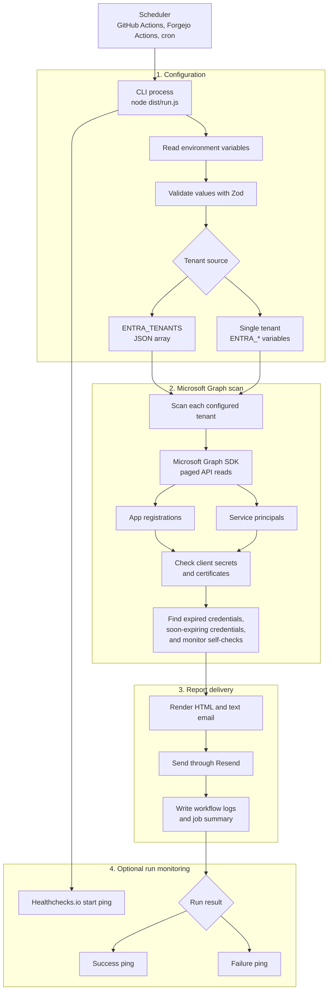

# Entra Credential Monitor

[](https://github.com/Peculiar-Cloud/entra-credential-monitor/actions/workflows/ci.yml)
[](https://github.com/Peculiar-Cloud/entra-credential-monitor/actions/workflows/codeql.yml)
[](https://github.com/Peculiar-Cloud/entra-credential-monitor/actions/workflows/container.yml)
[](https://github.com/Peculiar-Cloud/entra-credential-monitor/pkgs/container/entra-credential-monitor)
[](LICENSE)
[](renovate.json)
[](https://peculiar.cloud)

Scheduled credential-expiration monitoring for Microsoft Entra ID app
registrations and service principals.

Entra Credential Monitor scans Microsoft Graph for expired and soon-expiring
client secrets and certificates, then sends a compact HTML/text email report
through Resend. It is built as a small Node.js CLI, so it can run from GitHub
Actions, Forgejo Actions, cron, or any scheduler that can provide environment
variables.

Peculiar Cloud maintains this repository as a practical identity-security
automation for teams that want early warning before Entra application
credentials break production integrations.

## Stack

- Node.js 24 or newer.
- pnpm 11, pinned through `packageManager`.
- TypeScript 6 in strict mode.
- Zod 4 for environment and Microsoft Graph response validation.
- `@azure/identity` and `@microsoft/microsoft-graph-client`.
- Resend 6 for email delivery.
- Pino 10 for structured runtime logging.
- Chainguard non-root Node runtime for the optional container image.
- Vitest 4 and Biome 2.

## Features

- Monitors both app registrations and service principals.
- Detects expired and soon-expiring client secrets and certificates.
- Supports one tenant or many tenants in a single run.
- Self-monitors the monitor app's own credentials when the app can be found.
- Sends HTML and plain-text reports through Resend.
- Keeps high-volume reports readable by grouping long-expired credentials into a
  compact reference section.
- Validates Microsoft Graph responses with Zod and skips malformed records
  loudly instead of silently trusting partial data.
- Optionally pings Healthchecks.io on start, success, and failure.
- Ships a rootless GHCR container image for schedulers that prefer Docker.

## Example Report


[View the generated HTML example](docs/example-report.html)

## Quick Start

```sh
corepack enable
pnpm install
cp .env.example .env.local
```

Fill in `.env.local`, then run:

```sh
pnpm exec tsx --env-file=.env.local src/run.ts
```

1Password is not required. The CLI reads ordinary environment variables; use
plain `.env.local`, GitHub Actions secrets, or any secret manager you already
trust.

Build and run the compiled CLI:

```sh
pnpm build
node --env-file=.env.local dist/run.js
```

Run the published container image:

```sh
docker run --rm --env-file .env.local ghcr.io/peculiar-cloud/entra-credential-monitor:latest
```

## Microsoft Entra Setup

Create an app registration for the monitor in the tenant you want to scan.

1. In Azure Portal, open **Microsoft Entra ID** > **App registrations**.
2. Create a new registration for this monitor.
3. Copy the **Application (client) ID** and **Directory (tenant) ID**.
4. Create a client secret under **Certificates & secrets** and copy the secret
   value immediately.
5. Add Microsoft Graph application permissions:

| Permission | Purpose |
| --- | --- |
| `Application.Read.All` | Read app registrations and their credentials. |
| `Directory.Read.All` | Read service principals and owners. |
| `Organization.Read.All` | Read organization display name for reports. |

Grant admin consent after adding the permissions.

## Resend Setup

1. Create a Resend account.
2. Verify the sender domain you want to use.
3. Create an API key and set it as `RESEND_API_KEY`.
4. Set `SENDER_EMAIL` to an address on the verified domain.
5. Set `EMAIL_RECIPIENTS` to a comma-separated recipient list.

## Configuration

The app reads normal environment variables. You can use Node's `--env-file`,
GitHub Actions secrets, or any secret manager that injects environment variables
into the process.

Tenant configuration has two forms. `ENTRA_TENANTS` takes precedence when set.

```sh
ENTRA_TENANTS='[
  {
    "tenantId": "00000000-0000-0000-0000-000000000000",
    "clientId": "11111111-1111-1111-1111-111111111111",
    "clientSecret": "client-secret-value",
    "name": "Example Tenant"
  }
]'
```

For a single tenant, use individual variables:

```sh
ENTRA_TENANT_ID=00000000-0000-0000-0000-000000000000
ENTRA_CLIENT_ID=11111111-1111-1111-1111-111111111111
ENTRA_CLIENT_SECRET=client-secret-value
ENTRA_TENANT_NAME=Example Tenant
```

| Variable | Required | Default | Description |
| --- | --- | --- | --- |
| `ENTRA_TENANTS` | No | unset | JSON array of tenant configs. Preferred for multi-tenant runs. |
| `ENTRA_TENANT_ID` | Single-tenant only | unset | Directory tenant ID. |
| `ENTRA_CLIENT_ID` | Single-tenant only | unset | Monitor app registration client ID. |
| `ENTRA_CLIENT_SECRET` | Single-tenant only | unset | Monitor app registration client secret. |
| `ENTRA_TENANT_NAME` | No | `Unnamed Tenant` | Human-readable tenant label. |
| `RESEND_API_KEY` | Yes | unset | Resend API key. |
| `SENDER_EMAIL` | Yes | unset | Verified sender address. Also receives error notifications. |
| `EMAIL_RECIPIENTS` | Yes | unset | Comma-separated report recipients. |
| `TECHNICAL_CONTACT` | No | unset | Optional contact used in self-monitoring alert text. |
| `WARNING_DAYS` | No | `30` | Report credentials expiring within this many days. |
| `SELF_MONITORING_WARNING_DAYS` | No | `60` | Warning window for the monitor app's own credentials. |
| `EXPIRED_GRACE_DAYS` | No | `90` | Long-expired credentials older than this are collapsed in reports. |
| `ALWAYS_SEND_REPORT` | No | `false` | Send all-clear reports even when no issues are found. |
| `REPORT_TIMEZONE` | No | `America/New_York` | IANA time zone used for report dates and times. |
| `REPORT_BRAND_NAME` | No | `Peculiar Cloud` | Brand name shown in generated report headers and footers. |
| `REPORT_BRAND_URL` | No | `https://peculiar.cloud` | Brand link used in generated report footers. |
| `LOG_LEVEL` | No | `info` | Structured log level: `debug`, `info`, `warn`, `error`, or `silent`. |
| `HEALTHCHECKS_PING_URL` | No | unset | Healthchecks.io UUID or full ping URL. |

## Scheduling

See [GitHub Actions deployment](docs/github-actions.md) for a scheduled workflow
example and [container image deployment](docs/container.md) for Docker-based
schedulers. The same command works from any scheduler:

```sh
node dist/run.js
```

Make sure the scheduler injects the environment variables above before starting
the process.

## Architecture

Each scheduled run has one job: load tenant configuration, scan Microsoft Graph,
and deliver a report before exiting.



Key implementation details:

- Microsoft Graph paging uses the SDK `PageIterator`.
- The SDK middleware owns retry/throttling behavior for transient Graph errors.
- Every fetched page is validated before analysis.
- Unparseable credential dates are preserved and surfaced rather than dropped.
- The email renderer keeps Outlook/Gmail constraints in mind and has a size
  budget test for large tenants.

## Local Development

```sh
pnpm install
pnpm lint
pnpm typecheck
pnpm test
pnpm build
pnpm verify
```

Generate a real rendered email preview from your configured tenant:

```sh
pnpm exec tsx --env-file=.env.local scripts/redesign-preview.mts
```

The preview is written to `~/Downloads`.

## Dependency Updates

Renovate is configured in [renovate.json](renovate.json):

- Patch, pin, and digest updates automerge after CI passes.
- Minor updates are grouped for review.
- Major updates require dependency-dashboard approval.

The Renovate GitHub app must be enabled for the repository or organization for
this config to run.

## Security

- Do not commit real `.env` files or secret-manager references.
- Use least-privilege Microsoft Graph application permissions.
- Store `RESEND_API_KEY` and Entra client secrets in your scheduler's secret
  store.
- Rotate the monitor app's own credential before it expires; the
  self-monitoring check is designed to warn you early.
- The published container image runs as non-root UID/GID `65532` and is scanned
  with Trivy in CI.

Report security issues privately. See [SECURITY.md](SECURITY.md).

## Changelog

See [CHANGELOG.md](CHANGELOG.md).

## Support

Community issues and pull requests are welcome. For implementation help,
identity-security automation, monitoring design, or Microsoft Entra hardening,
contact Peculiar Cloud at
<https://peculiar.cloud>.

## License

MIT License. See [LICENSE](LICENSE).
